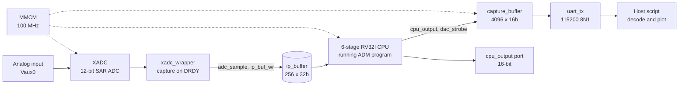

# ADM on a 6-Stage Pipelined RISC-V CPU (Spartan-7 FPGA)

Adaptive Delta Modulation (ADM) implemented **as software** on a custom-built
6-stage pipelined RV32I processor, running on the RealDigital Boolean Board
(Xilinx Spartan-7 XC7S50CSGA324-1). A live analog input is sampled by the
on-chip XADC, processed by the CPU, and the reconstructed signal is streamed
off-chip over UART for verification.

There is no dedicated ADM datapath. The algorithm is 47 hand-assembled RV32I
instructions; the only ADM-specific hardware is the ADC/DAC/capture glue.

---

## Table of Contents

1. [Highlights](#highlights)
2. [System Architecture](#system-architecture)
3. [Repository Layout](#repository-layout)
4. [Hardware Platform](#hardware-platform)
5. [Clocking and Reset](#clocking-and-reset)
6. [CPU Microarchitecture](#cpu-microarchitecture)
7. [ADM Algorithm](#adm-algorithm)
8. [ADC Front End and Real-Time Synchronization](#adc-front-end-and-real-time-synchronization)
9. [Output and Verification Path](#output-and-verification-path)
10. [Implementation Results](#implementation-results)
11. [Build and Run](#build-and-run)
12. [Debugging with ILA](#debugging-with-ila)
13. [Regenerating the Program](#regenerating-the-program)
14. [Known Issues and Limitations](#known-issues-and-limitations)
15. [Future Work](#future-work)
16. [Author and License](#author-and-license)

---

## Highlights

- Custom **6-stage pipeline** (IF, ID, EX1, EX2, MEM, WB) written from scratch in Verilog
- **EX stage split into EX1/EX2** to close timing at 100 MHz
- **2-cycle load-use stall**, **3-source forwarding**, **3-stage flush** on taken branches and jumps
- **`adc_stall`**: pipeline freeze that keeps the CPU read pointer behind the XADC write pointer
- **RV32I only** (no M extension): multiplication-style operations use shift-and-add
- **Timing closed at 100 MHz** with 0 failing endpoints
- CPU core is **1,769 LUTs (about 5.4% of the device)**

---

## System Architecture



Top-level module: `adm_top`

| Port | Dir | Description |
|---|---|---|
| `clk_in` | in | 100 MHz board oscillator |
| `reset` | in | Board reset |
| `VP`, `VN` | in | Differential analog input (wired to XADC Vaux0) |
| `cpu_output[15:0]` | out | Reconstructed signal (integrator value) |
| `UART_txd` | out | UART transmit to host |

All logic runs on a **single clock domain** generated by the MMCM. There are no
clock-domain crossings in the design.

---

## Repository Layout

```
adm-riscv-fpga/
├── rtl/
│   ├── adm_top.v            Top level: wiring, reset synchronizer
│   ├── cpu.v                6-stage pipelined RV32I core
│   ├── program_counter.v    Program counter
│   ├── register_file.v      32x32 register file (write-through bypass)
│   ├── alu.v                ALU (add/sub/logic/shift/slt/sltu)
│   ├── alu_ctrl_unit.v      ALU control decode
│   ├── main_ctrl_unit.v     Main control decode
│   ├── imm_gen.v            Immediate generator (I/S/B/U/J)
│   ├── mmcm.v               MMCME2_BASE clock generation
│   ├── xadc_wrapper.v       XADC instance + sample trigger + DRDY capture
│   ├── capture_buffer.v     4096-sample capture + UART drain FSM
│   └── uart_tx.v            8N1 UART transmitter
├── constraints/
│   └── boolean_board.xdc    Pin mapping, clock constraint, debug constraints
├── sw/
│   └── adm.s                ADM assembly source
├── host/
│   └── capture_plot.py      UART receiver, decoder, live plot
└── docs/                    Timing/utilization screenshots, plots, report
```

---

## Hardware Platform

| Item | Detail |
|---|---|
| Board | RealDigital Boolean Board |
| FPGA | Xilinx Spartan-7 XC7S50CSGA324-1 |
| System clock | 100 MHz on-board oscillator, through an MMCM |
| Analog input | On-chip XADC, auxiliary channel Vaux0 (`DADDR = 7'h10`) |
| Host link | UART over USB, 115200 baud, 8N1 |
| Toolchain | Vivado (synthesis, implementation, ILA) |

---

## Clocking and Reset

The board oscillator feeds an `MMCME2_BASE`. Input and output are both 100 MHz,
but the clock is regenerated through the VCO for deskew and jitter cleanup, and
`LOCKED` gates system reset.

| Stage | Formula | Value |
|---|---|---|
| Input | 1 / `CLKIN1_PERIOD` (10.0 ns) | 100 MHz |
| VCO | (100 MHz x `CLKFBOUT_MULT_F` 10.0) / `DIVCLK_DIVIDE` 1 | 1000 MHz |
| Output `CLKOUT0` | VCO / `CLKOUT0_DIVIDE_F` 10.0 | 100 MHz |

Feedback path: `CLKFBOUT` -> `BUFG` -> `CLKFBIN`.

**Reset:** `async_reset = reset | ~locked`. It asserts asynchronously and is
released through a 2-flip-flop synchronizer on the 100 MHz clock (`sys_reset`).

---

## CPU Microarchitecture

### Pipeline stages

| Stage | Function |
|---|---|
| IF | PC register, instruction fetch from `inst_mem` (256 x 32b, word-addressed by `pc[9:2]`). PC holds on stall. |
| ID | Decode, immediate generation, register-file read, load-use hazard detection |
| EX1 | ALU operation with forwarded operands. AUIPC uses PC as operand A. |
| EX2 | Branch decision (all six RV32I branch types), branch/JAL/JALR target calculation, flush generation |
| MEM | Load from `ip_buffer` (word-addressed by `alu_result[9:2]`); stores drive `cpu_output` and `dac_strobe` |
| WB | Result mux: ALU result / memory data / PC+4 / immediate (LUI) |

Pipeline registers: `IF/ID`, `ID/EX1`, `EX1/EX2`, `EX2/MEM`, `MEM/WB`.

**Why EX is split:** in the original 5-stage version, the ALU plus branch
comparison formed a critical path that could not close at 100 MHz. Registering
the ALU result between EX1 and EX2 and resolving branches in EX2 shortened it.
Cost: one extra stage, a deeper load-use stall, and a longer branch penalty.

### Memory model

There is no general-purpose data RAM.

| Memory | Size | Access |
|---|---|---|
| `inst_mem` | 256 x 32b | Fetch only, initialized in an `initial` block |
| `ip_buffer` | 256 x 32b | Written by the XADC path, read by CPU loads |
| Register file | 32 x 32b | x0 hardwired to zero, write-through bypass to ID reads |

Loads return a full 32-bit word (no byte/halfword loads). Stores do not write
memory; a store drives the output port instead.

### Hazard handling

**Load-use hazard (2-cycle stall).** A load's data is only available in MEM, two
stages later than in a 5-stage core. The hazard unit therefore checks for a
pending load in both EX1 and EX2:

```verilog
assign load_use_hazard =
    (id_ex1_mem_r && (id_ex1_rd != 5'b0) &&
     ((id_ex1_rd == rs1) || (id_ex1_rd == rs2))) ||
    (ex1_ex2_mem_r && (ex1_ex2_rd != 5'b0) &&
     ((ex1_ex2_rd == rs1) || (ex1_ex2_rd == rs2)));
```

While asserted: PC and IF/ID hold, and a bubble is written into ID/EX1.

| Cycle | IF | ID | EX1 | EX2 | MEM | WB |
|---|---|---|---|---|---|---|
| 1 | lw | | | | | |
| 2 | use | lw | | | | |
| 3 | next | use | lw | | | |
| 4 | next | use | bubble | lw | | |
| 5 | next | use | bubble | bubble | lw | |
| 6 | n+1 | next | use | bubble | bubble | lw |

**Forwarding (3 sources)**, newest first:

| Priority | Source | Notes |
|---|---|---|
| 1 | `EX1/EX2` ALU result | |
| 2 | `EX2/MEM` | For loads, forwards the **loaded data**, not the address |
| 3 | `MEM/WB` write-back value | |

Forwarding muxes feed both EX1 ALU operands.

**Control hazards.** Branches and jumps resolve in EX2. A taken branch or any
JAL/JALR asserts `flush`, clearing `IF/ID`, `ID/EX1` and `EX1/EX2` (3 squashed
instructions, 3-cycle penalty). There is no branch predictor.

### Supported instructions

R-type ALU, I-type ALU, `lw`, `sw`, `lui`, `auipc`, `beq/bne/blt/bge/bltu/bgeu`,
`jal`, `jalr`. No M extension, CSRs, exceptions or interrupts.

---

## ADM Algorithm

Delta modulation tracks the input by moving an integrator up or down by a step
each sample. **Adaptive** delta modulation also scales the step:

- error keeps the same sign: the integrator is still chasing the signal, so the step **grows x1.5**
- error changes sign: the integrator has crossed the signal, so the step **shrinks x0.5**

This limits slope overload on fast edges and granular noise on flat regions.

### Pseudocode

```
integrator = 2048          // mid-range of the 12-bit ADC
prev_error = 0
step       = MIN_STEP

LOOP:
    sample = MEM[input_ptr]
    error  = sample - integrator

    if sign(error) != sign(prev_error):
        step = step >> 1
    else:
        step = step + (step >> 1)

    step = clamp(step, MIN_STEP, MAX_STEP)

    if error == 0:       (no change)
    else if error < 0:   integrator -= step
    else:                integrator += step

    integrator = clamp(integrator, 0, OUT_MAX)   // OUT_MAX = 4095

    MEM[output_ptr] = integrator      // drives cpu_output + dac_strobe
    prev_error = error
    input_ptr += 4;  output_ptr += 4
    goto LOOP
```

### Register map

| Register | Role |
|---|---|
| x1 | input pointer |
| x2 | output pointer |
| x4 | integrator |
| x5 | step size |
| x6 | prev_error |
| x8 | current sample |
| x9 | error |
| x10 | sign(error) |
| x11 | sign(prev_error) |
| x14 | MIN_STEP |
| x15 | scratch / compare result |
| x16 | MAX_STEP |
| x19 | OUT_MAX (4095) |

### Program layout (`inst_mem`)

| Index | Purpose |
|---|---|
| 0-1 | Initialize input/output pointers |
| 2-3 | MIN_STEP, MAX_STEP constants |
| 4-6 | Build OUT_MAX = 4095 (addi, slli, addi) |
| 7-9 | integrator = 2048 (lui + addi), prev_error = 0 |
| 10 | step = MIN_STEP |
| 11 | `lw` sample (loop start) |
| 12-15 | error, sign(error), sign(prev_error), sign-change test |
| 16-20 | Step decrease / increase |
| 21-28 | Step clamp to [MIN_STEP, MAX_STEP] |
| 29-33 | Integrator update |
| 34-41 | Integrator clamp to [0, OUT_MAX] |
| 42 | `sw` integrator (output) |
| 43-45 | prev_error update, pointer increments |
| 46 | `jal x0, LOOP` |

---

## ADC Front End and Real-Time Synchronization

### XADC sampling

`xadc_wrapper` instantiates the XADC on Vaux0.

- A counter requests a conversion every `SAMPLE_PERIOD` = 100 clock cycles (a **1 MHz trigger**). The next request is only issued after the previous conversion completes.
- The result is captured on **`DRDY`**, not on the timer. `DEN` only starts a conversion; `DO` is not valid until `DRDY` pulses.
- Each valid result is zero-extended into `adc_sample` and `ip_buf_wr` pulses for one cycle.

### Input buffer

```verilog
if (ip_buf_wr) begin
    ip_buffer[addr_ip_buf[7:0]] <= adc_sample;   // 256-deep circular buffer
    addr_ip_buf <= addr_ip_buf + 1;              // 32-bit counter, never wraps
end
```

`addr_ip_buf` is a full 32-bit counter (an 8-bit version deadlocked at sample
255). Only the low 8 bits index the buffer.

### `adc_stall`

The CPU consumes samples in the same order the ADC produces them. If the CPU
gets ahead, it must wait:

```verilog
assign adc_stall = ex2_mem_mem_r &&
                   ({24'b0, ex2_mem_alu_result[9:2]} >= addr_ip_buf);
```

The load index is compared with the ADC write counter. While the load is
waiting on a sample that has not arrived, the PC, `IF/ID`, `ID/EX1` and
`EX2/MEM` registers freeze and the same load retries every cycle. This ties the
CPU's throughput to the real-time sample rate without interrupts.

---

## Output and Verification Path

### Output port and strobe

A store instruction (`ex2_mem_mem_w`) latches the integrator into `cpu_output`
and pulses `dac_strobe` for one cycle. `dac_strobe` is also the sample tick for
the capture buffer.

### Capture buffer

`capture_buffer` stores 4096 samples, each packed as `{4'b0000, cpu_output[11:0]}`
in a 16-bit word, then drains the batch over UART.

FSM: `CAPTURE` -> `SYNC0..3` -> `DRAIN_HI` / `DRAIN_LO` (repeated) -> back to
`CAPTURE`. A shared `S_WAIT` state waits for the UART to go idle between bytes.

While draining, new `dac_strobe` ticks are ignored, so **consecutive batches are
not contiguous in time**.

### UART stream format

| Field | Bytes | Value |
|---|---|---|
| Sync header | 4 | `AA 55 AA 55` (once per batch) |
| Per sample | 2 | high byte (`{4'b0, sample[11:8]}`), low byte (`sample[7:0]`) |

Decode on the host: `sample = (hi << 8) | lo`. For valid data, `hi <= 0x0F` and
`sample <= 4095`; anything outside that range is flagged as corrupt.

`uart_tx`: 8N1, `BIT_PERIOD = CLK_FREQ / BAUD_RATE = 868` clocks per bit. One
4096-sample batch is about 8 KB and takes roughly 0.7 s on the wire.

---

## Implementation Results

### Timing (Vivado, 100 MHz)

All user-specified timing constraints are met.

| Check | Worst slack | Total negative slack | Failing endpoints | Endpoints |
|---|---|---|---|---|
| Setup (WNS) | 0.139 ns | 0.000 ns | 0 | 14,345 |
| Hold (WHS) | 0.030 ns | 0.000 ns | 0 | 14,329 |
| Pulse width (WPWS) | 3.000 ns | 0.000 ns | 0 | 7,449 |

Setup margin is small, so there is little headroom at 100 MHz without further
pipelining.

### Resource utilization (XC7S50)

| Resource | Used | Available | % |
|---|---|---|---|
| Slice LUTs | 5,004 | 32,600 | 15.4 |
| Slice registers | 6,159 | 65,200 | 9.4 |
| Block RAM tiles | 11.5 | 75 | 15.3 |
| Bonded IOB | 21 | 210 | 10.0 |
| MMCME2_ADV | 1 | 5 | 20 |
| XADC | 1 | 1 | 100 |

By hierarchy:

| Module | LUTs | Registers | BRAM tiles |
|---|---|---|---|
| `adm_cpu_unit` (CPU core) | 1,769 | 854 | 0 |
| `xadc_wrapper_unit` | 35 | 61 | 0 |
| `u_capture` (capture buffer) | 45 | 77 | 2 |
| `u_ila_0` | 1,728 | 2,868 | 8 |
| `u_ila_1` | 931 | 1,512 | 1.5 |
| `dbg_hub` | 472 | 753 | 0 |

The CPU core is about **5.4% of the device's LUTs**. Most of the rest of the
top-level total is ILA debug instrumentation, not design logic. The CPU's
`inst_mem` and `ip_buffer` map to distributed RAM (220 LUTs as memory), not
block RAM.

---

## Build and Run

**Requirements:** Vivado (Spartan-7 support), Python 3, `pyserial` and
`matplotlib` for the host script, RealDigital Boolean Board.

1. Recreate the project:
   ```
   vivado -mode batch -source scripts/create_project.tcl
   ```
2. Run synthesis and implementation, generate the bitstream.
3. Program the Boolean Board over USB.
4. Feed an analog signal into the Vaux0 input (keep it within the XADC input
   range: 0 to 1 V unipolar).
5. Run the host script:
   ```
   python host/capture_plot.py --port COMx --baud 115200
   ```

The plot title reports batch number, min/max and the count of out-of-range
samples. Out-of-range points are drawn in red.

---

## Debugging with ILA

Signals marked `(* mark_debug = "true" *)`:

| Group | Signals |
|---|---|
| Fetch/decode | `pc`, `if_id_inst` |
| Hazards | `load_use_hazard`, `adc_stall` |
| Pipeline | `id_ex1_rd`, `id_ex1_mem_r`, `ex1_ex2_rd`, `ex1_ex2_mem_r` |
| Memory/output | `ex2_mem_alu_result`, `ex2_mem_rd2`, `ex2_mem_mem_w`, `ex2_mem_mem_r`, `mem_data`, `dac_strobe` |
| ADC | `ip_buf_wr`, `addr_ip_buf`, `adc_sample`, `period_cnt`, `den_reg`, `conv_pending`, `drdy`, `DO`, `channel` |

---

## Regenerating the Program

The ADM program is assembled from `sw/adm.s` by the label-resolving assembler
(correct branch and jump offsets are computed automatically):

```
python sw/assembler.py sw/adm.s
```

Paste the output into the `inst_mem` initial block in `rtl/cpu.v`. Keep
`adm.s` and `cpu.v` in sync so the machine code is always traceable to source.

---

## Known Issues and Limitations

**Capture-buffer drain alignment (identified from RTL trace, fix pending).**
`rd_word` is a registered memory read, but the read address advances in
`S_WAIT` and `S_DRAIN_HI` runs on the very next cycle, so the high byte is
taken from the previous word. The transmitted pair is (`hi[n]`, `lo[n+1]`).
Effect: whenever `sample[11:8]` changes between consecutive samples, the decoded
value is off by about 256 (spike down on rising slopes, spike up on falling
slopes). The same path also sends 4095 pairs per batch instead of 4096.
Fix: advance the read address during `S_DRAIN_LO`, and do not advance it after
`SYNC3`.

**UART framing is fragile.** The sync header is sent once per batch; one lost
or corrupted byte misaligns the rest of the batch. Per-sample or periodic
resync markers would remove this.

**`adc_stall` freeze scope.** `EX2/MEM` freezes but `EX1/EX2` does not. This is
safe in the ADM program because the instructions behind the `lw` are always
bubbles (its consumer follows immediately). A program with independent
instructions after a load would lose or duplicate instructions during a stall.

**Other limitations**
- RV32I only; no M extension, CSRs, exceptions or interrupts
- No sub-word loads/stores and no general data RAM
- No branch prediction (3-cycle taken-branch penalty)
- Instruction memory is initialized in RTL, not loaded at runtime
- Setup slack at 100 MHz is 0.139 ns, so timing is tight

---

## Future Work

- Fix the capture-buffer drain alignment and add per-sample UART resync
- Explicit stall/freeze handling on every pipeline register
- Run the CPU on a higher clock with further pipeline balancing
- Branch prediction to reduce the taken-branch penalty
- Recalibrate the analog front end so signal peaks stay inside the XADC range
- Extend the core into the follow-on RISC-V SoC with a fuller peripheral set

---